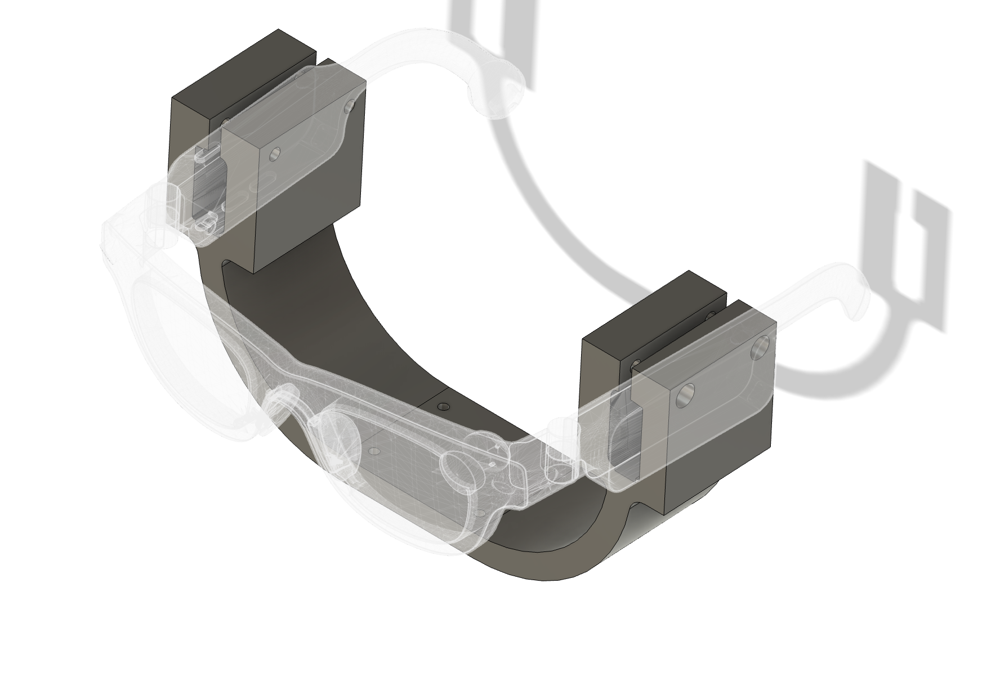
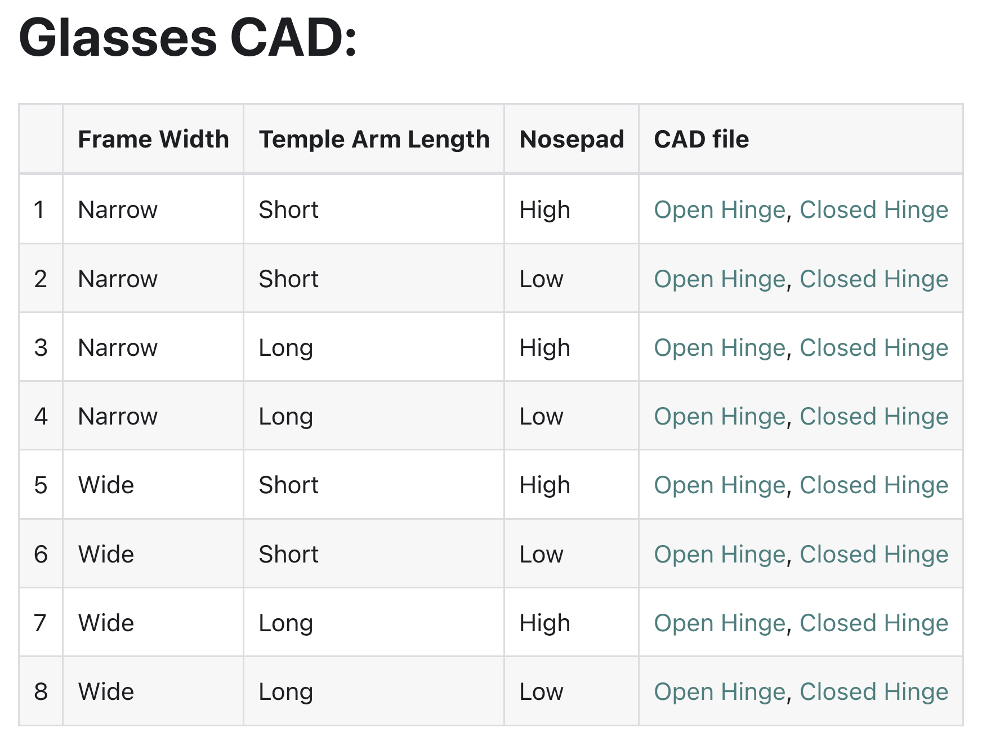

# Aria2 Holder

> A custom holder for the **Aria2 Glass** on the **RB-Y1 Robot**



## Design

Based on **#4 "Narrow, Long, Low"** design from the official [Aria2 Glass Holder CAD specs](https://facebookresearch.github.io/projectaria_tools/gen2/technical-specs/device/cad).




### Note

This version has a slightly tight fit for the Aria2 Glass. Future iterations may increase the hole diameter for a looser fit.


## Files

| Folder | Description | Contents |
|--------|-------------|----------|
| `cad/` | CAD source files | `aria2_holder_v0_narrow_print_0.step` |
| `images/` | Renders & previews | `aria2_holder_v0_shaded.png`, `aria2_holder_v0_w_hidden_lines.png` |
| `stl/` | Print-ready meshes | `aria2_holder_v0_print_0.stl` |

File structure:

```bash
chuye@Chuyes-Laptop aria2_holder % tree
.
├── cad # CAD file
│   └── aria2_holder_v0_narrow_print_0.step
├── images # Overview Images
│   ├── aria2_holder_v0_shaded.png
│   └── aria2_holder_v0_w_hidden_lines.png
└── stl # STL files for printing (printed Jan 26, 2026)
    └── aria2_holder_v0_print_0.stl
```

*Printed: Jan 26, 2026*
