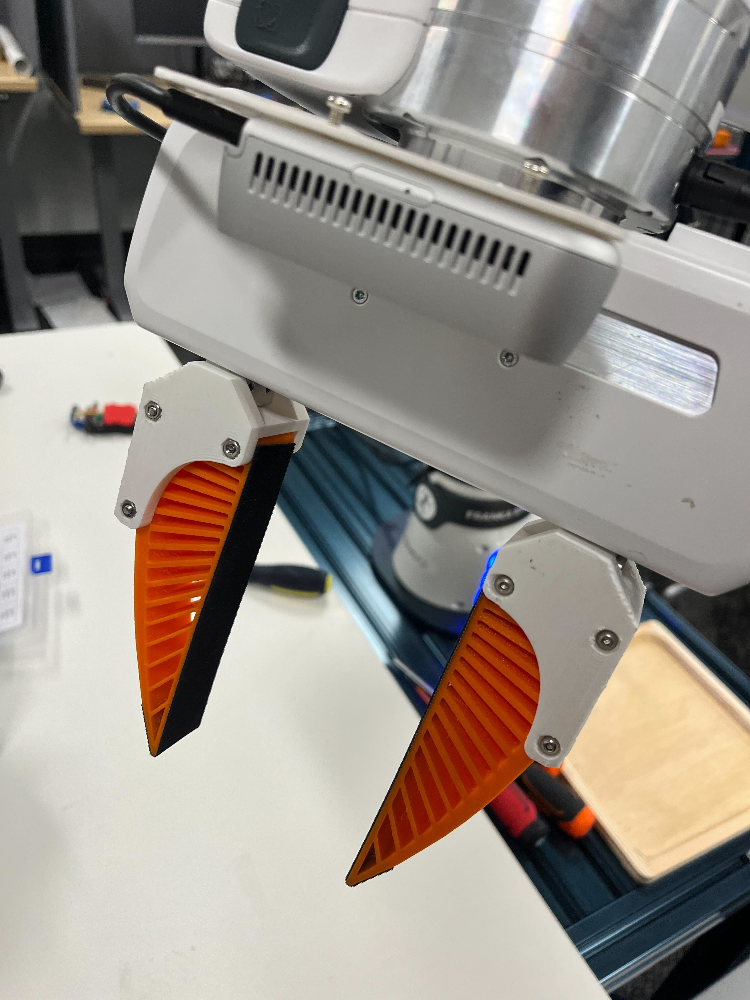
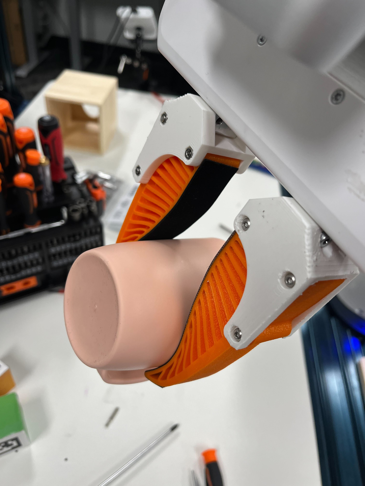

## 3D Printed Flexible Gripper

### Parts:
- (6x) M3 x 45mm screws
- (6x) M3 nuts
- (4x) M4 x 16mm screws (Socket or Round)
- (2x) 3D Print: Mounting cage for Franka Panda gripper ([3D Printing file from OnShape](https://cad.onshape.com/documents/925ed7a4fa3cf94745609f74/w/366f0a5c1a64253a81b4791b/e/125be876eddeed32c06cd14c?renderMode=0&uiState=6531960a58f2ef1ee8863a96))
- (2x) 3D print: Flexible gripper tip (file included in this folder)
- Friction tape (1.5 inch in width)

Mounting cage can be printed with normal PLA filament. OVERTRUE TPU 1.75mm filament works well for flexible tip
